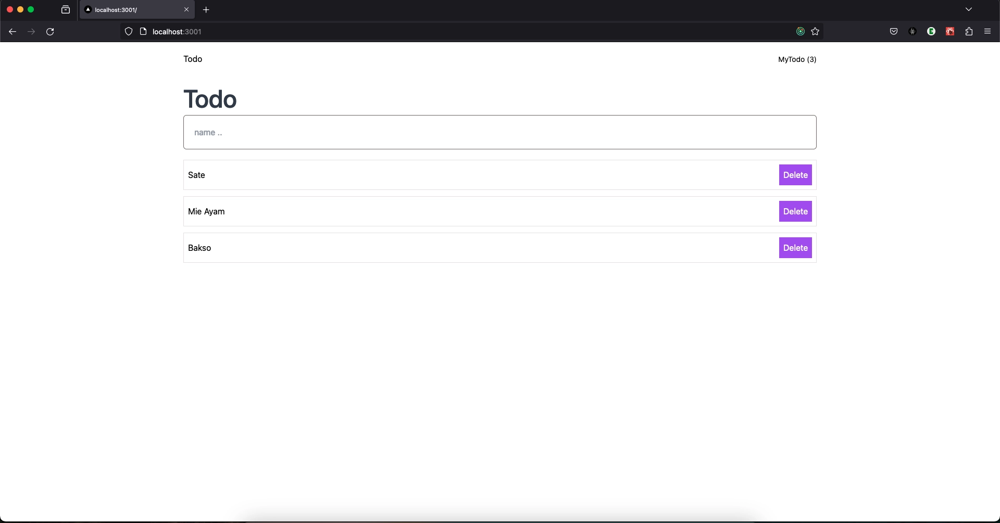
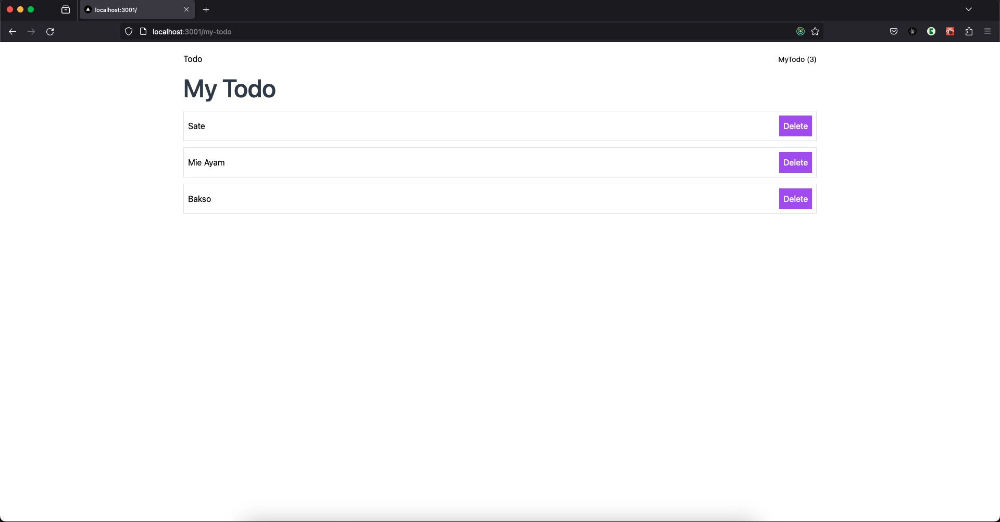

# State Management Next.JS + Easy Peasy

Learn NextJS State Management using Easy Peasy

## Screenshots




## Getting Started

First, run the development server:

```bash
npm run install
# then
npm run dev
# or
yarn dev
# or
pnpm dev
```

Open [http://localhost:3000](http://localhost:3000) with your browser to see the result.


## Features

- Todo List
- Add Todo
- Delete Todo
- Store todo data on Easy Peasy
- Persist data using Easy Peasy


## Acknowledgements

 - [Easy Peasy](https://easy-peasy-v4.vercel.app)
 - [NextJS 14](https://nextjs.org)
 - [Javascript Filter](https://developer.mozilla.org/en-US/docs/Web/JavaScript/Reference/Global_Objects/Array/filter)


## Learn More

To learn more about Next.js, take a look our youtube video

- [Belajar Next.js dari awal](https://youtu.be/aoiFiT6txV4)
